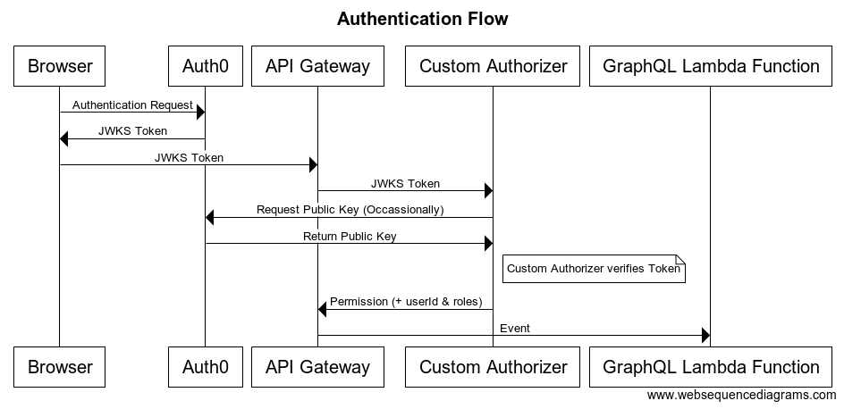

# Authentication and Authorization

## Overview

This directory contains functionality for authentication and authorization.

* [Auth0](auth0.ts) - authenticates users, issues tokens
* [AWS Custom Authorizer](handlers.ts) - verifies Auth0 tokens
* [Roles](roles.ts) and [Scopes](scopes.ts) - control access
* [GraphQL context object](graphql-context.ts) - wraps authorization functionality for use in GraphQL resolvers

## Authentication Flow
Precise.ly uses Auth0 to manage user accounts and authentication.  Users sign up, login and change and reset passwords through Auth0.
On login, Auth0 authenticates a user and issues a token, which the user's browser presents to API gateway.  The custom authorizer in  [handlers.ts](./handlers.ts) verifies the token and determines the user's roles. When the GraphQL API handler is called, the roles (and other information) are available via the event argument passed to the handler: `event.requestContext.authorizer`.  The GraphQL API makes these values available via the [`GraphQLContext` object](./graphql-context.ts), which is passed as the third argument to each resolver.



See [AWS: Output from a custom authorizer](https://docs.aws.amazon.com/apigateway/latest/developerguide/api-gateway-lambda-authorizer-output.html ).

## Authorization

The GraphQL handler generates a context object ([`GraphQLContext`](graphql-context.ts)), which is passed as the context argument to GraphQL resolver functions. The GraphQLContext contains helpful information like `userId` and `roles` and provides a method for testing whether the current user can perform an action.

Roles [RBACPlus](https://github.com/aneilbaboo/rbac-plus) to define roles and scopes (permissions).

Resolvers can test whether access is permitted by using the `GraphQLContext.can(scope, resource)` method, or the `@scope` decorator.

```typescript
import {accessControl} from 'access-control';
accessControl
  .grant('user')
    .resource('Report')
      .action('read').fields()
      .action('update').where(userIsOwner).withConstraint()
      .action('delete').where(userIsOwner).withConstraint(ensureOwnerIdIsUserId);

class ReportResolver {
  @scope('admin', 'Report:read')
  id(report: Report, args: any, context: GraphQLContext) {
    ...
  }
}
```


